# Visual-Inertial SLAM
Simultaneous Localization and Mapping (SLAM) problem is a well-known problem in robotics, where a robot has to localize itself and map its environment simultaneously. The extended Kalman filter (EKF) is the nonlinear version of the Kalman filter which linearizes about an estimate of the current mean and covariance. In the case of well defined transition models, the EKF has been considered the de facto standard in the theory of nonlinear state estimation

In this project, visual-inertial SLAM based on Extended Kalman Filter(EKF) and landmark is implemented. The proposed solution is evaluated with real-world measurements from an IMU and a stereo camera installed in a car. It can estimate reliable maps and trajectory on various datasets in a reasonable time.

## File details
### main.py:
1) Uses utils.py to load data. 
2) 1. **IMU Localization via EKF Prediction:** Predicts the IMU Pose 
    2. **Landmark Mapping via EKF Update:** If new features are observed intializes the prior If previously obvserved features are observed, then updates landmark positions based on predicted and observed feature positions.
    3. **Visual-Inertial SLAM:** Updates the IMU pose and Landmark positions.
3) The code is well commented for further details

### utils.py:
1) To read visual features, IMU measurements and calibration parameters
2) visualize_trajectory_2d() fucntion to display landmarks as well using scatter plot

## Techincal report
* [Saurabh Himmatlal Mirani. "Visual-Inertial SLAM" March. 2020](report/Visual_InertialSLAM.pdf)

## Results
### Dataset 1:
#### Dead reckoning:

  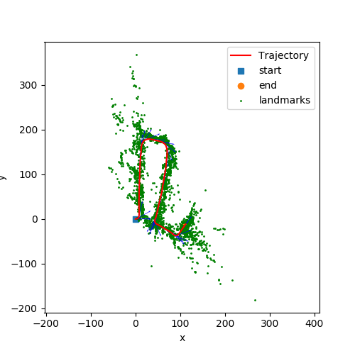
  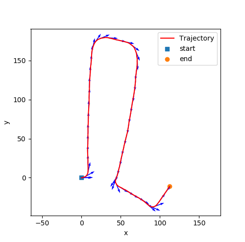 
  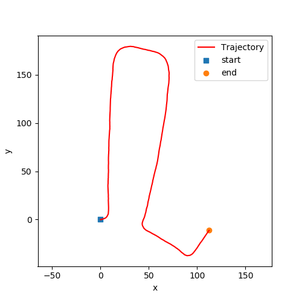 

#### Using Visual-Inertial SLAM:

  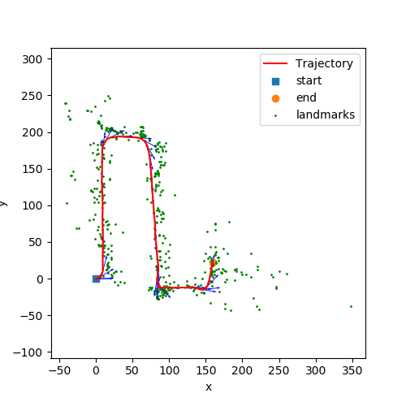
  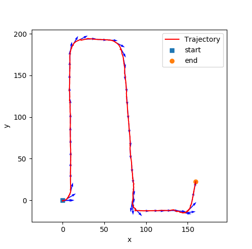 
  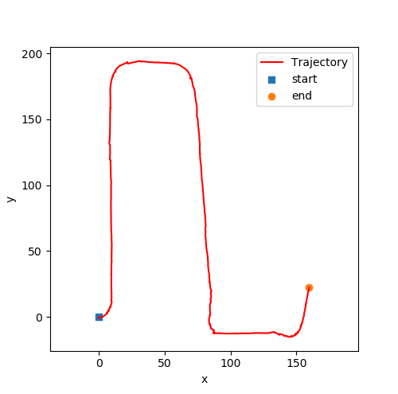 

### Dataset 2:
#### Dead reckoning:

  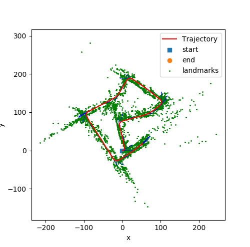
  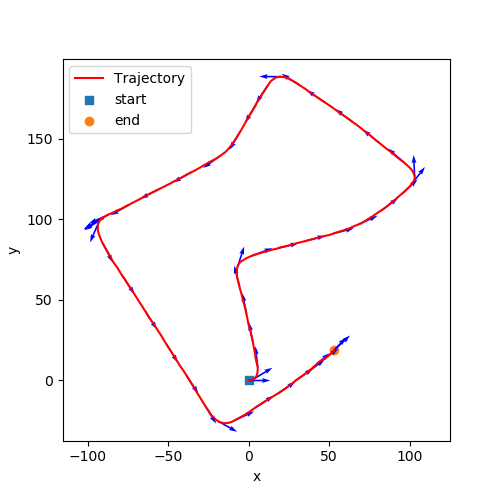 
  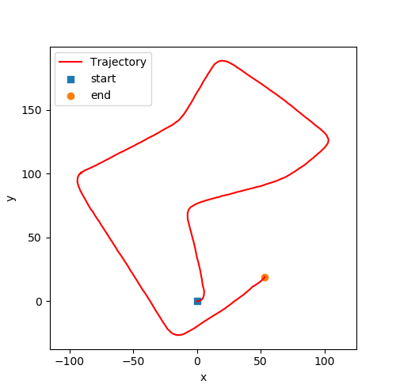 

#### Using Visual-Inertial SLAM:

  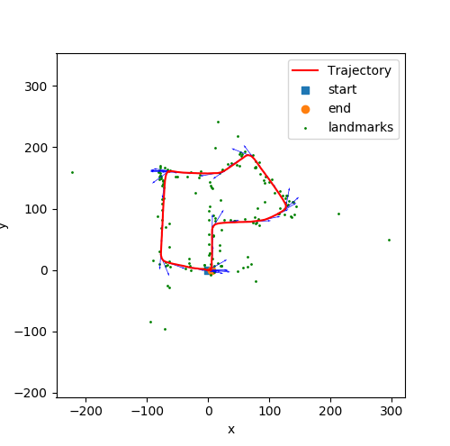
  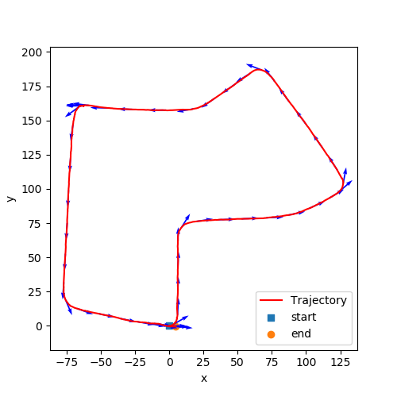 
  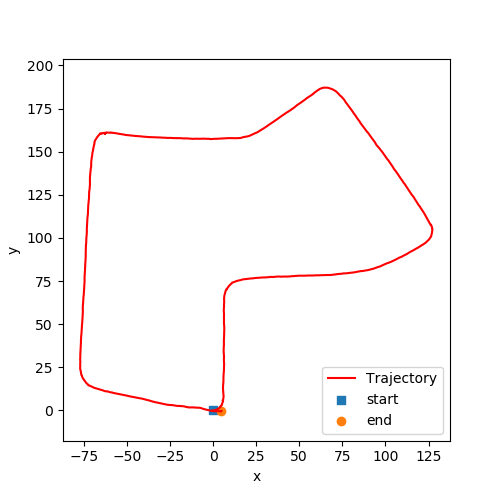 

### Dataset 3:
#### Dead reckoning:

  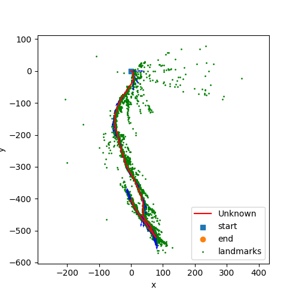
  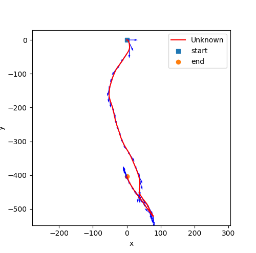 
  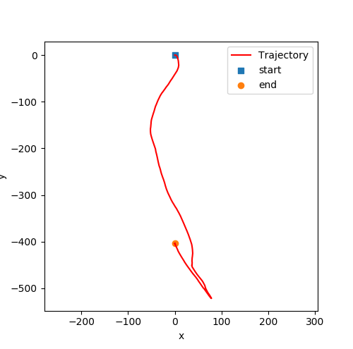 

#### Using Visual-Inertial SLAM:

  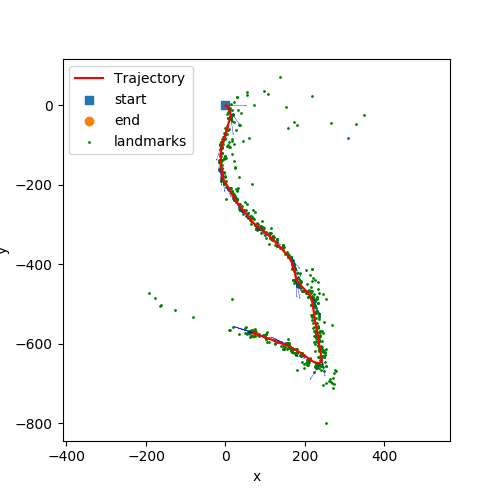
   
  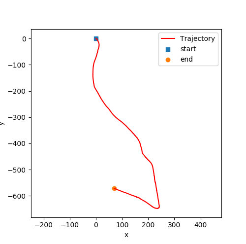 

